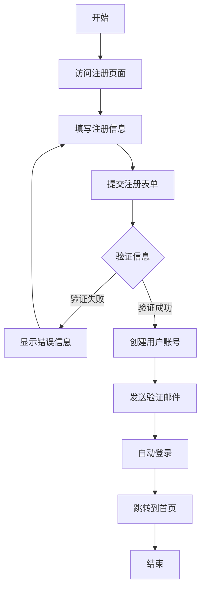
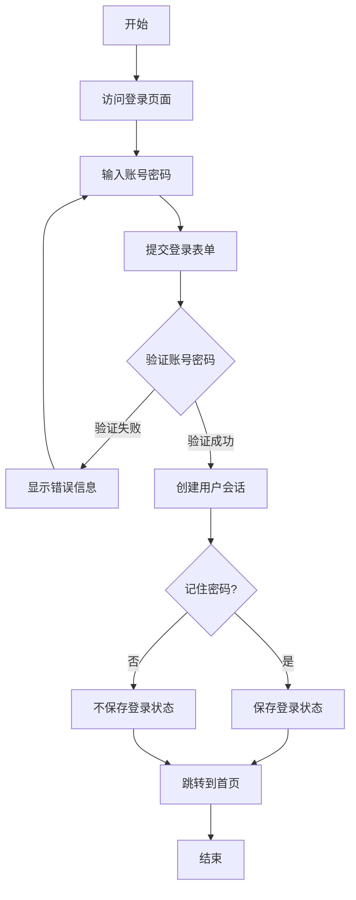
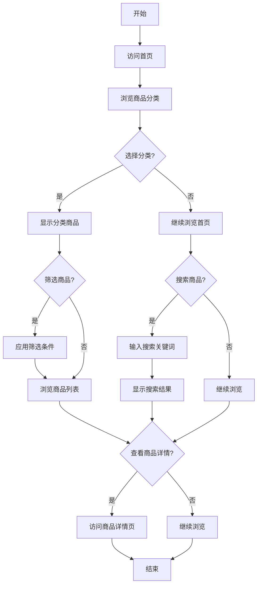
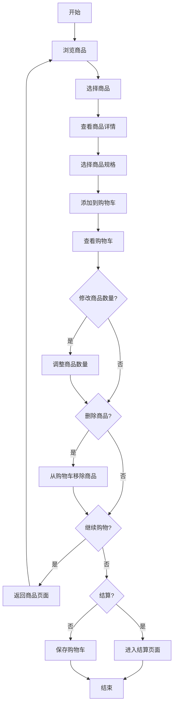
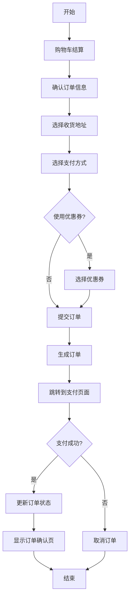
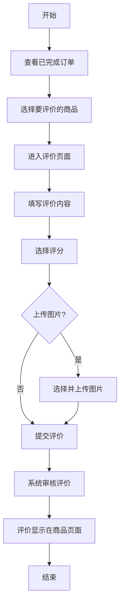
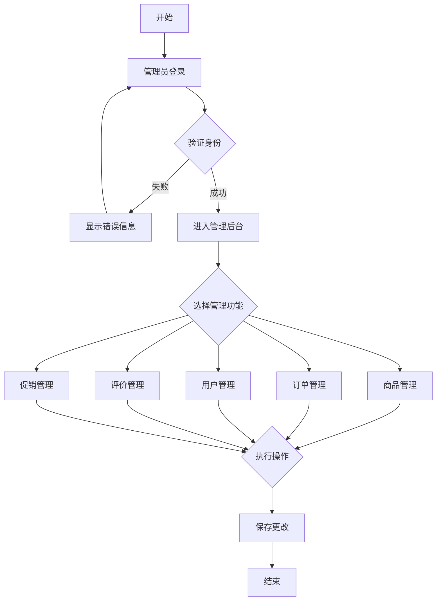

# 百货网站流程图

## 1. 用户注册流程

```mermaid
flowchart TD
    A[开始] --> B[访问注册页面]
    B --> C[填写注册信息]
    C --> D[提交注册表单]
    D --> E{验证信息}
    E -->|验证失败| F[显示错误信息]
    F --> C
    E -->|验证成功| G[创建用户账号]
    G --> H[发送验证邮件]
    H --> I[自动登录]
    I --> J[跳转到首页]
    J --> K[结束]
```

## 2. 用户登录流程

```mermaid
flowchart TD
    A[开始] --> B[访问登录页面]
    B --> C[输入账号密码]
    C --> D[提交登录表单]
    D --> E{验证账号密码}
    E -->|验证失败| F[显示错误信息]
    F --> C
    E -->|验证成功| G[创建用户会话]
    G --> H{记住密码?}
    H -->|是| I[保存登录状态]
    H -->|否| J[不保存登录状态]
    I --> K[跳转到首页]
    J --> K
    K --> L[结束]
```

## 3. 商品浏览流程

```mermaid
flowchart TD
    A[开始] --> B[访问首页]
    B --> C[浏览商品分类]
    C --> D{选择分类?}
    D -->|是| E[显示分类商品]
    D -->|否| F[继续浏览首页]
    E --> G{筛选商品?}
    G -->|是| H[应用筛选条件]
    G -->|否| I[浏览商品列表]
    H --> I
    F --> J{搜索商品?}
    J -->|是| K[输入搜索关键词]
    J -->|否| L[继续浏览]
    K --> M[显示搜索结果]
    M --> N{查看商品详情?}
    I --> N
    L --> N
    N -->|是| O[访问商品详情页]
    N -->|否| P[继续浏览]
    O --> Q[结束]
    P --> Q
```

## 4. 购物车管理流程

```mermaid
flowchart TD
    A[开始] --> B[浏览商品]
    B --> C[选择商品]
    C --> D[查看商品详情]
    D --> E[选择商品规格]
    E --> F[添加到购物车]
    F --> G[查看购物车]
    G --> H{修改商品数量?}
    H -->|是| I[调整商品数量]
    H -->|否| J{删除商品?}
    I --> J
    J -->|是| K[从购物车移除商品]
    J -->|否| L{继续购物?}
    K --> L
    L -->|是| M[返回商品页面]
    M --> B
    L -->|否| N{结算?}
    N -->|是| O[进入结算页面]
    N -->|否| P[保存购物车]
    O --> Q[结束]
    P --> Q
```

## 5. 订单处理流程

```mermaid
flowchart TD
    A[开始] --> B[购物车结算]
    B --> C[确认订单信息]
    C --> D[选择收货地址]
    D --> E[选择支付方式]
    E --> F{使用优惠券?}
    F -->|是| G[选择优惠券]
    F -->|否| H[提交订单]
    G --> H
    H --> I[生成订单]
    I --> J[跳转到支付页面]
    J --> K{支付成功?}
    K -->|是| L[更新订单状态]
    K -->|否| M[取消订单]
    L --> N[显示订单确认页]
    N --> O[结束]
    M --> O
```

## 6. 商品评价流程

```mermaid
flowchart TD
    A[开始] --> B[查看已完成订单]
    B --> C[选择要评价的商品]
    C --> D[进入评价页面]
    D --> E[填写评价内容]
    E --> F[选择评分]
    F --> G{上传图片?}
    G -->|是| H[选择并上传图片]
    G -->|否| I[提交评价]
    H --> I
    I --> J[系统审核评价]
    J --> K[评价显示在商品页面]
    K --> L[结束]
```

## 7. 后台管理流程

```mermaid
flowchart TD
    A[开始] --> B[管理员登录]
    B --> C{验证身份}
    C -->|失败| D[显示错误信息]
    D --> B
    C -->|成功| E[进入管理后台]
    E --> F{选择管理功能}
    F --> G[商品管理]
    F --> H[订单管理]
    F --> I[用户管理]
    F --> J[评价管理]
    F --> K[促销管理]
    G --> L{执行操作}
    H --> L
    I --> L
    J --> L
    K --> L
    L --> M[保存更改]
    M --> N[结束]
```

<!--来源：元宝，提示词：电子商务系统流程图，范围：流程图.md 全文--> 