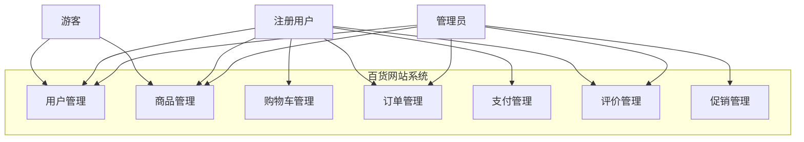
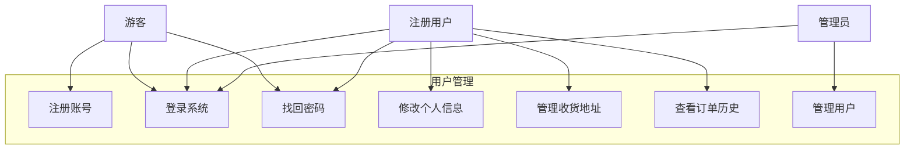
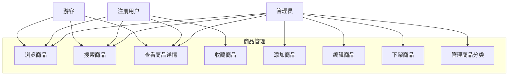
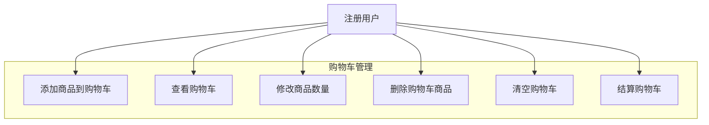
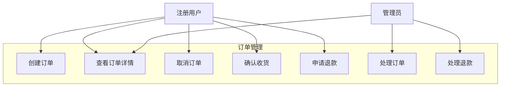
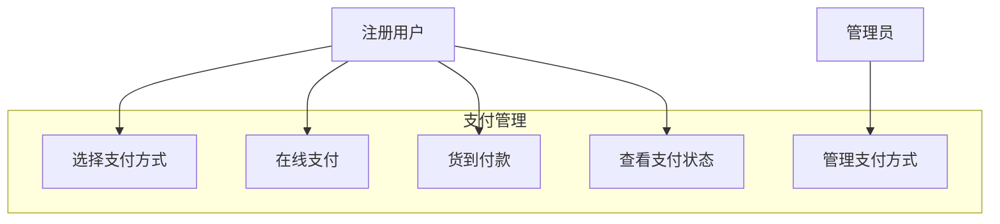
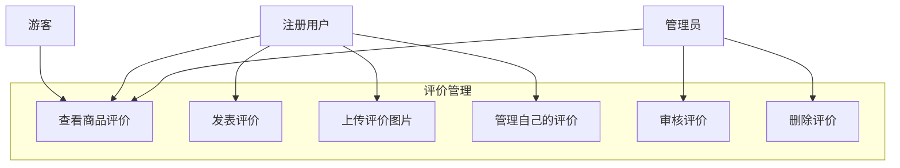
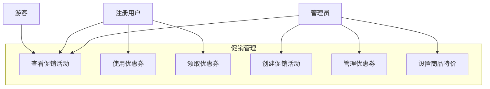

# 百货网站用例图

## 1. 系统总体用例图

```mermaid
flowchart TD
    subgraph 百货网站系统
        UC1[用户管理]
        UC2[商品管理]
        UC3[购物车管理]
        UC4[订单管理]
        UC5[支付管理]
        UC6[评价管理]
        UC7[促销管理]
    end
    
    A1[游客] --> UC1
    A1 --> UC2
    
    A2[注册用户] --> UC1
    A2 --> UC2
    A2 --> UC3
    A2 --> UC4
    A2 --> UC5
    A2 --> UC6
    
    A3[管理员] --> UC1
    A3 --> UC2
    A3 --> UC4
    A3 --> UC6
    A3 --> UC7
```

## 2. 用户管理用例图

```mermaid
flowchart TD
    subgraph 用户管理
        UC1[注册账号]
        UC2[登录系统]
        UC3[找回密码]
        UC4[修改个人信息]
        UC5[管理收货地址]
        UC6[查看订单历史]
        UC7[管理用户]
    end
    
    A1[游客] --> UC1
    A1 --> UC2
    A1 --> UC3
    
    A2[注册用户] --> UC2
    A2 --> UC3
    A2 --> UC4
    A2 --> UC5
    A2 --> UC6
    
    A3[管理员] --> UC2
    A3 --> UC7
```

## 3. 商品管理用例图

```mermaid
flowchart TD
    subgraph 商品管理
        UC1[浏览商品]
        UC2[搜索商品]
        UC3[查看商品详情]
        UC4[收藏商品]
        UC5[添加商品]
        UC6[编辑商品]
        UC7[下架商品]
        UC8[管理商品分类]
    end
    
    A1[游客] --> UC1
    A1 --> UC2
    A1 --> UC3
    
    A2[注册用户] --> UC1
    A2 --> UC2
    A2 --> UC3
    A2 --> UC4
    
    A3[管理员] --> UC1
    A3 --> UC2
    A3 --> UC3
    A3 --> UC5
    A3 --> UC6
    A3 --> UC7
    A3 --> UC8
```

## 4. 购物车管理用例图

```mermaid
flowchart TD
    subgraph 购物车管理
        UC1[添加商品到购物车]
        UC2[查看购物车]
        UC3[修改商品数量]
        UC4[删除购物车商品]
        UC5[清空购物车]
        UC6[结算购物车]
    end
    
    A[注册用户] --> UC1
    A --> UC2
    A --> UC3
    A --> UC4
    A --> UC5
    A --> UC6
```

## 5. 订单管理用例图

```mermaid
flowchart TD
    subgraph 订单管理
        UC1[创建订单]
        UC2[查看订单详情]
        UC3[取消订单]
        UC4[确认收货]
        UC5[申请退款]
        UC6[处理订单]
        UC7[处理退款]
    end
    
    A1[注册用户] --> UC1
    A1 --> UC2
    A1 --> UC3
    A1 --> UC4
    A1 --> UC5
    
    A2[管理员] --> UC2
    A2 --> UC6
    A2 --> UC7
```

## 6. 支付管理用例图

```mermaid
flowchart TD
    subgraph 支付管理
        UC1[选择支付方式]
        UC2[在线支付]
        UC3[货到付款]
        UC4[查看支付状态]
        UC5[管理支付方式]
    end
    
    A1[注册用户] --> UC1
    A1 --> UC2
    A1 --> UC3
    A1 --> UC4
    
    A2[管理员] --> UC5
```

## 7. 评价管理用例图

```mermaid
flowchart TD
    subgraph 评价管理
        UC1[查看商品评价]
        UC2[发表评价]
        UC3[上传评价图片]
        UC4[管理自己的评价]
        UC5[审核评价]
        UC6[删除评价]
    end
    
    A1[游客] --> UC1
    
    A2[注册用户] --> UC1
    A2 --> UC2
    A2 --> UC3
    A2 --> UC4
    
    A3[管理员] --> UC1
    A3 --> UC5
    A3 --> UC6
```

## 8. 促销管理用例图

```mermaid
flowchart TD
    subgraph 促销管理
        UC1[查看促销活动]
        UC2[使用优惠券]
        UC3[领取优惠券]
        UC4[创建促销活动]
        UC5[管理优惠券]
        UC6[设置商品特价]
    end
    
    A1[游客] --> UC1
    
    A2[注册用户] --> UC1
    A2 --> UC2
    A2 --> UC3
    
    A3[管理员] --> UC1
    A3 --> UC4
    A3 --> UC5
    A3 --> UC6
```

<!--来源：元宝，提示词：电子商务系统用例图，范围：用例图.md 全文--> 